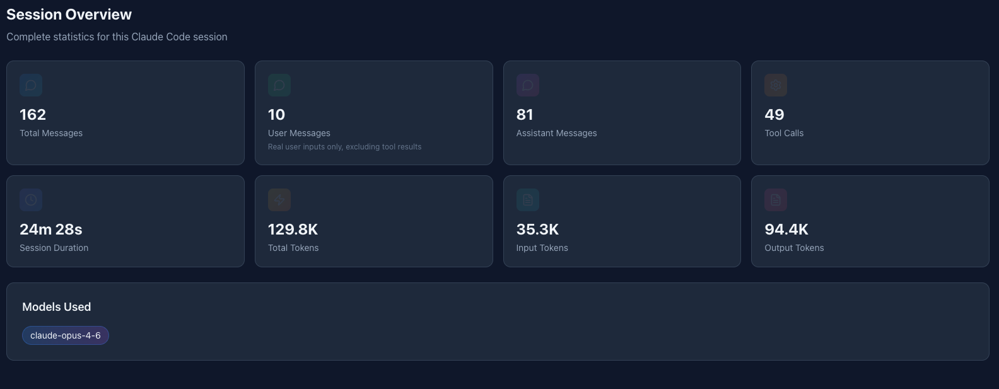
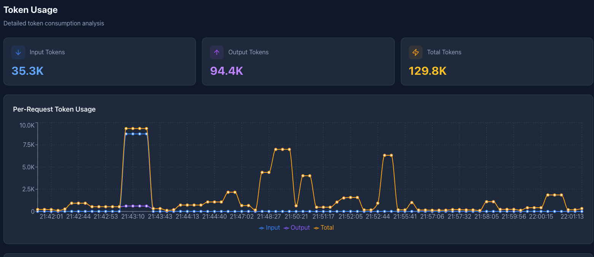
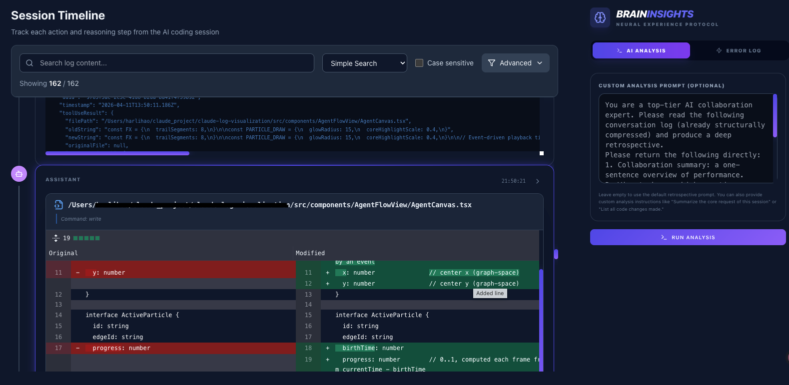
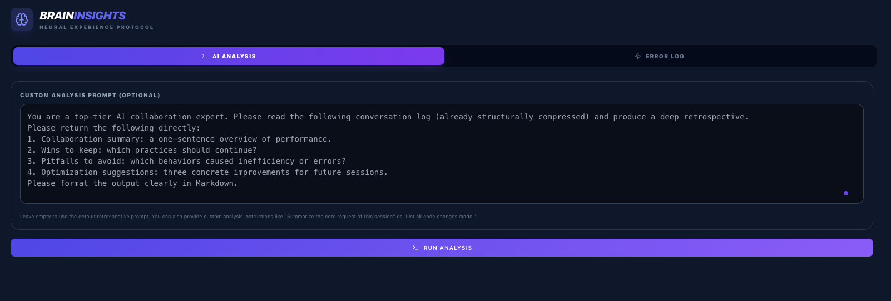
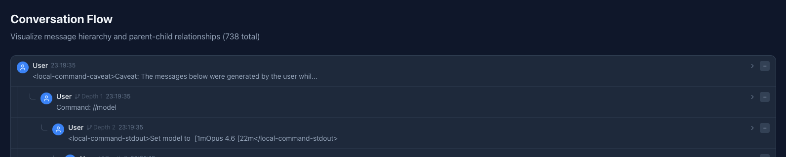
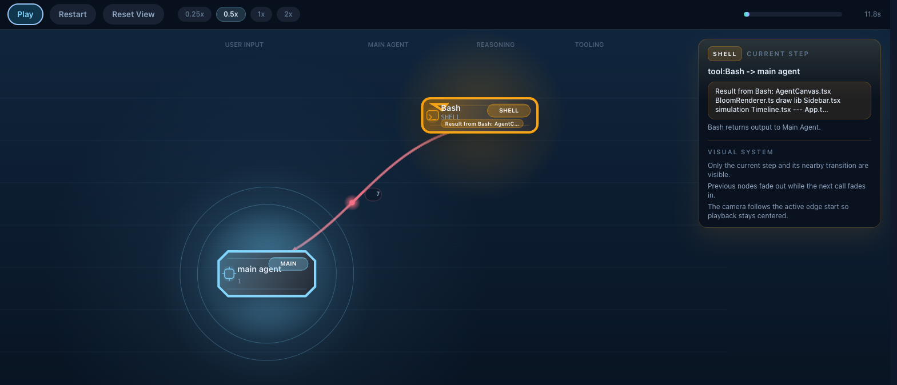
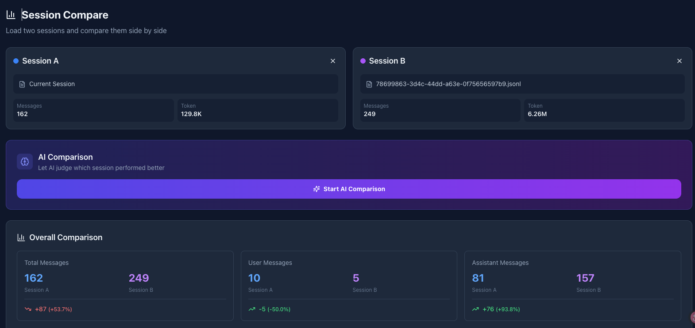
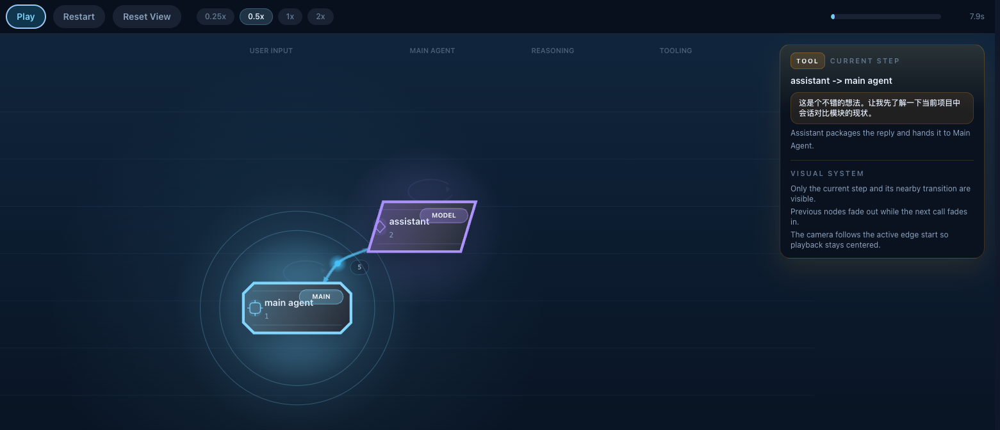

# Claude Log Analyzer

<p align="center">
  <strong>Turn raw Claude Code logs into something you can actually understand.</strong>
</p>

<p align="center">
  Replay agent behavior, inspect tool calls, spot token spikes, compare sessions, and figure out why an AI coding run went great or sideways.
</p>

<p align="center">
  <a href="https://github.com/harrylettering/claude-log-analyzer/stargazers">Star on GitHub</a>
  ·
  <a href="#quick-start">Quick Start</a>
  ·
  <a href="#screenshots">Screenshots</a>
  ·
  <a href="#why-people-star-this">Why People Star This</a>
</p>

<p align="center">
  
  
  
  
  
</p>



## Why People Star This

Most Claude Code session logs are technically rich and visually painful.

This project turns `.jsonl` logs into a visual debugging and review workspace so you can:

- See what the agent actually did, in order
- Understand which tool calls consumed time and tokens
- Replay agent-to-tool handoffs instead of reading raw event blocks
- Compare two sessions to learn what changed
- Review prompt quality and collaboration patterns after a run

If you use Claude Code seriously, this helps you move from "I have a log file" to "I know what happened."

## What Makes It Useful

- **Agent Flow Replay**: watch the call graph animate step by step around the main agent
- **Current Step Context**: inspect what is happening right now, not just the final output
- **Searchable Timeline**: browse tool calls, thoughts, diffs, file reads, terminal commands, and results
- **Token Analytics**: identify expensive turns and usage spikes fast
- **Session Compare**: diff two runs across messages, tokens, tools, and models
- **AI Retrospective**: surface strengths, weaknesses, and next-step improvements
- **Prompt Review**: inspect prompt and collaboration quality after the fact

## Built For

- Developers debugging noisy Claude Code sessions
- People reviewing long agent runs with many tools
- Teams trying to understand why one prompt or workflow worked better than another
- Anyone who wants to learn from real AI coding traces instead of guessing

## Demo

- Overview video: [claude-log-analyzer-github.mp4](docs/screenshots/claude-log-analyzer-github.mp4)
- Full demo clip: [claude-log-analyzer.mp4](docs/screenshots/claude-log-analyzer.mp4)

## Screenshots

### Session Intelligence

| Session Overview | Token Usage |
| --- | --- |
|  |  |

| Session Timeline | AI Analysis |
| --- | --- |
|  |  |

### Flow Visualization

| Conversation Flow | Agent Flow |
| --- | --- |
|  |  |

| Session Compare | Agent Flow Assistant Return |
| --- | --- |
|  |  |

## Quick Start

### Requirements

- Node.js 18+
- npm

### Install

```bash
git clone https://github.com/harrylettering/claude-log-analyzer.git
cd claude-log-analyzer
npm install
```

### Run

```bash
./start.sh
```

Open `http://localhost:3000`.

### Build

```bash
npm run build
```

### Preview Production Build

```bash
npm run preview
```

## In 30 Seconds

1. Open the app locally.
2. Load a Claude Code `.jsonl` log.
3. Jump between timeline, token, flow, compare, and analysis views.
4. Find the exact step where the run slowed down, got noisy, or went off track.

## Main Views

| View | What You Learn |
| --- | --- |
| Session Overview | High-level stats for tokens, messages, models, duration, and tools |
| Session Timeline | Chronological actions, tool usage, diffs, and results |
| Agent Flow | Animated handoffs between user, main agent, assistant, and tools |
| Conversation Flow | Parent-child structure and message depth |
| Token Usage | Spikes, cost-heavy turns, and usage trends |
| AI Analysis | Retrospective insights and suggested improvements |
| Prompt Optimizer | Prompt quality review and collaboration guidance |
| Session Compare | What changed between two runs |
| Real-Time Log | Raw event stream inspection |

## Why It Exists

Claude Code sessions can become long, tool-heavy, and hard to audit from raw logs alone.

This project exists to make those sessions reviewable:

- for debugging
- for performance tuning
- for prompt iteration
- for agent workflow learning
- for sharing and comparing runs with others

## Supported Log Data

Claude Log Analyzer is built around Claude Code `.jsonl` session logs.

Typical entry types include:

- `user`
- `assistant`
- `system`
- tool-use and tool-result content blocks
- permission and metadata events
- file history snapshots

Common fields used by the parser include:

- `uuid`
- `parentUuid`
- `timestamp`
- `type`
- `message`
- `isSidechain`
- `isMeta`

## Tech Stack

- React 18
- TypeScript 5
- Vite 5
- Tailwind CSS 3
- Recharts
- Framer Motion
- Lucide React
- html2canvas
- Zustand
- XYFlow / React Flow

## Project Structure

```text
claude-log-analyzer/
├── docs/
│   └── screenshots/          # README media and product visuals
├── src/
│   ├── components/           # Dashboards and visualization UI
│   ├── hooks/                # Playback and interaction hooks
│   ├── types/                # Domain types
│   ├── utils/                # Parsing, analysis, and helper logic
│   ├── App.tsx               # Application shell
│   ├── main.tsx              # Entry point
│   └── index.css             # Global styling
├── package.json
└── README.md
```

## Development

```bash
npm run dev       # Start the Vite development server
npm run build     # Type-check and build for production
npm run preview   # Preview the production build locally
npm run lint      # Run ESLint
```

## Roadmap

- Ship a stronger README hero with a short looping demo
- Add anonymized sample logs so first-time users can explore instantly
- Improve large-session performance and visualization density
- Add more flow layout modes for complex agent chains
- Add export presets for reports and retrospectives

## Contributing

Contributions are welcome.

Good contribution areas:

- parser improvements
- UI polish
- performance work for large logs
- new analysis panels
- sample datasets and reproducible bug cases

If this project helped you understand Claude Code sessions faster, a GitHub Star really helps other people find it.

## License

MIT
